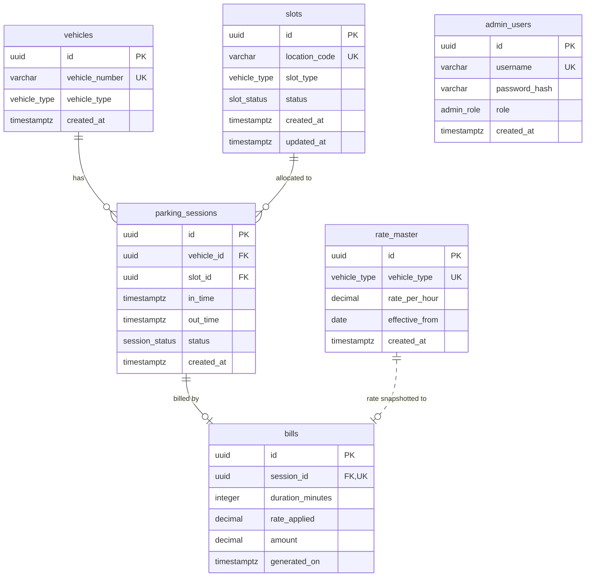

# Smart Parking Management System — Database Layer

[](https://nodejs.org/)
[](https://www.postgresql.org/)
[](https://www.prisma.io/)
[](https://www.typescriptlang.org/)

The database layer and relational schema implementation for the **Smart Parking Management System**, engineered for high concurrency, auditable transaction tracking, real-time slot occupancy tracking, and deterministic historical billing.

This repository represents the **database-design implementation phase**: models, PostgreSQL native enums, indexes, custom SQL constraints, versioned Prisma migrations, idempotent seeding, and smoke-testing suite.

---

## Table of Contents
- [Architecture and Design Principles](#architecture-and-design-principles)
- [Entity-Relationship Overview](#entity-relationship-overview)
- [Data Dictionary and Models](#data-dictionary-and-models)
- [Custom Database Constraints and Rules](#custom-database-constraints-and-rules)
- [Project Structure](#project-structure)
- [Getting Started](#getting-started)
  - [Prerequisites](#prerequisites)
  - [Environment Setup](#environment-setup)
  - [Installation and Migrations](#installation-and-migrations)
  - [Database Seeding](#database-seeding)
  - [Visual Inspection (Prisma Studio)](#visual-inspection-prisma-studio)
  - [Running Verification Tests](#running-verification-tests)
- [Available Scripts](#available-scripts)
- [License](#license)

---

## Architecture and Design Principles

1. **Third Normal Form (3NF) Compliance**:
   - Eliminates data redundancy: `vehicles`, `slots`, `rate_master`, `parking_sessions`, `bills`, and `admin_users` are independent relational tables linked strictly via foreign keys.
2. **UUID Primary Keys**:
   - Every entity generates a non-sequential, random UUID (`@id @default(uuid()) @db.Uuid`). Prevents guessable enumeration attacks on public API endpoints.
3. **Historical Billing Integrity**:
   - The `bills` table snapshots the applied hourly rate (`rate_applied`) at the moment a session closes. Future rate changes in `rate_master` never retroactively alter past transaction amounts.
4. **Naming Conventions**:
   - **Database level**: `snake_case` table and column names via Prisma's `@@map` and `@map`.
   - **Application / Code level**: `camelCase` model accessors generated in the TypeScript Prisma Client.
   - **Enums**: Native PostgreSQL enum types (`CREATE TYPE ... AS ENUM`), ensuring type safety at the database engine level.

---

## Entity-Relationship Overview



---

## Data Dictionary and Models

### 1. `vehicles` (`Vehicle`)
Represents vehicles entering and using the facility.
| Column | Type | Constraints | Description |
| :--- | :--- | :--- | :--- |
| `id` | `UUID` | `PRIMARY KEY`, default random | Unique identifier |
| `vehicle_number` | `VARCHAR(15)` | `UNIQUE`, `NOT NULL` | License plate number (e.g. `KA-01-AB-1234`) |
| `vehicle_type` | `ENUM` | `NOT NULL` (`CAR`, `SCOOTER`) | Categorization for bay allocation |
| `created_at` | `TIMESTAMPTZ` | `NOT NULL`, `DEFAULT now()` | First registration timestamp |

### 2. `slots` (`Slot`)
Represents physical parking bays.
| Column | Type | Constraints | Description |
| :--- | :--- | :--- | :--- |
| `id` | `UUID` | `PRIMARY KEY`, default random | Unique bay identifier |
| `location_code` | `VARCHAR(10)` | `UNIQUE`, `NOT NULL` | Bay identifier (e.g. `C-01`, `S-02`) |
| `slot_type` | `ENUM` | `NOT NULL` (`CAR`, `SCOOTER`) | Supported vehicle category |
| `status` | `ENUM` | `NOT NULL`, `DEFAULT 'VACANT'` | `VACANT`, `OCCUPIED`, `OUT_OF_SERVICE` |
| `created_at` | `TIMESTAMPTZ` | `NOT NULL`, `DEFAULT now()` | Creation timestamp |
| `updated_at` | `TIMESTAMPTZ` | `NOT NULL`, auto-updated | Last status modification timestamp |

*Index*: Composite index on `(slot_type, status)` for instant vacant bay lookups.

### 3. `rate_master` (`RateMaster`)
Configuration table for category-wise hourly tariffs.
| Column | Type | Constraints | Description |
| :--- | :--- | :--- | :--- |
| `id` | `UUID` | `PRIMARY KEY`, default random | Unique tariff identifier |
| `vehicle_type` | `ENUM` | `UNIQUE`, `NOT NULL` (`CAR`, `SCOOTER`) | Target vehicle category |
| `rate_per_hour` | `DECIMAL(8,2)`| `NOT NULL` | Configured hourly rate (e.g. `40.00`) |
| `effective_from`| `DATE` | `NOT NULL` | Date when the rate takes effect |
| `created_at` | `TIMESTAMPTZ` | `NOT NULL`, `DEFAULT now()` | Creation timestamp |

### 4. `parking_sessions` (`ParkingSession`)
Core operational transaction log tracking entry, occupancy, and exit.
| Column | Type | Constraints | Description |
| :--- | :--- | :--- | :--- |
| `id` | `UUID` | `PRIMARY KEY`, default random | Unique session identifier |
| `vehicle_id` | `UUID` | `FK -> vehicles.id`, `ON DELETE RESTRICT` | Associated vehicle |
| `slot_id` | `UUID` | `FK -> slots.id`, `ON DELETE RESTRICT` | Associated slot |
| `in_time` | `TIMESTAMPTZ` | `NOT NULL` | Entry timestamp |
| `out_time` | `TIMESTAMPTZ` | `NULLABLE` | Exit timestamp (NULL while active) |
| `status` | `ENUM` | `NOT NULL`, `DEFAULT 'ACTIVE'` | `ACTIVE`, `COMPLETED` |
| `created_at` | `TIMESTAMPTZ` | `NOT NULL`, `DEFAULT now()` | Session record creation time |

*Indexes*: Index on `status`, composite index on `(vehicle_id, status)`.

### 5. `bills` (`Bill`)
Final billing receipt issued on vehicle checkout.
| Column | Type | Constraints | Description |
| :--- | :--- | :--- | :--- |
| `id` | `UUID` | `PRIMARY KEY`, default random | Unique receipt identifier |
| `session_id` | `UUID` | `FK -> parking_sessions.id`, `UNIQUE`, `ON DELETE CASCADE` | 1-to-1 session link |
| `duration_minutes` | `INTEGER` | `NOT NULL` | Calculated stay duration |
| `rate_applied` | `DECIMAL(8,2)`| `NOT NULL` | Snapshot of hourly rate at checkout |
| `amount` | `DECIMAL(10,2)`| `NOT NULL` | Total amount charged |
| `generated_on` | `TIMESTAMPTZ` | `NOT NULL`, `DEFAULT now()` | Receipt issue timestamp |

### 6. `admin_users` (`AdminUser`)
Authentication and RBAC records for operators and managers.
| Column | Type | Constraints | Description |
| :--- | :--- | :--- | :--- |
| `id` | `UUID` | `PRIMARY KEY`, default random | Unique user identifier |
| `username` | `VARCHAR(50)` | `UNIQUE`, `NOT NULL` | Login username |
| `password_hash`| `VARCHAR(255)`| `NOT NULL` | Salted bcrypt hash |
| `role` | `ENUM` | `NOT NULL` (`ADMIN`, `OPERATOR`) | RBAC permission level |
| `created_at` | `TIMESTAMPTZ` | `NOT NULL`, `DEFAULT now()` | Account creation timestamp |

---

## Custom Database Constraints and Rules

Enforced directly in PostgreSQL via migration [`prisma/migrations/20260904000002_add_custom_constraints/migration.sql`](prisma/migrations/20260904000002_add_custom_constraints/migration.sql):

1. **Timestamp Sanity (`CHECK` Constraint)**:
   ```sql
   ALTER TABLE "parking_sessions"
   ADD CONSTRAINT "chk_parking_sessions_out_time"
   CHECK ("out_time" IS NULL OR "out_time" > "in_time");
   ```
   *Guarantees a vehicle can never be recorded with an exit time earlier than or equal to its entry time.*

2. **At Most One Active Session Per Vehicle (Partial Unique Index)**:
   ```sql
   CREATE UNIQUE INDEX "unique_active_vehicle_session"
   ON "parking_sessions" ("vehicle_id")
   WHERE "status" = 'ACTIVE';
   ```
   *Prevents duplicate entry for a vehicle that is already marked active inside the facility.*

3. **Prevent Slot Double-Booking (Partial Unique Index)**:
   ```sql
   CREATE UNIQUE INDEX "unique_active_slot_session"
   ON "parking_sessions" ("slot_id")
   WHERE "status" = 'ACTIVE';
   ```
   *Guarantees two concurrent vehicles can never occupy the same slot simultaneously.*

---

## Project Structure

```
.
├── .env.example                                      # Environment variable connection template
├── .gitignore                                         # Ignores .env, node_modules, logs
├── package.json                                       # Node project metadata and scripts
├── tsconfig.json                                      # TypeScript compiler options
├── README.md                                          # Technical documentation
├── prisma/
│   ├── schema.prisma                                  # Declarative schema definition
│   ├── seed.ts                                        # Idempotent seeding script
│   └── migrations/                                    # Version-controlled migration history
│       ├── migration_lock.toml
│       ├── 20260904000001_init/
│       │   └── migration.sql                          # Base DDL for tables, enums, FKs and indexes
│       └── 20260904000002_add_custom_constraints/
│           └── migration.sql                          # Raw SQL CHECK constraints and partial indexes
└── test/
    └── smoke.ts                                       # Comprehensive smoke-testing script
```

---

## Getting Started

### Prerequisites
- [Node.js](https://nodejs.org/) (v18 or newer)
- [PostgreSQL](https://www.postgresql.org/) (v14+ running locally or in Docker)

### Environment Setup
Create a `.env` file from the example template:
```bash
cp .env.example .env
```
Update `DATABASE_URL` in `.env` with your PostgreSQL credentials:
```env
DATABASE_URL="postgresql://<USER>:<PASSWORD>@localhost:5432/<DATABASE_NAME>?schema=public"
```

### Installation and Migrations
Install all dependencies:
```bash
npm install
```
Deploy the database migrations to your PostgreSQL instance:
```bash
npm run db:migrate
```
*(Or use `npx prisma migrate deploy` in CI/CD environments).*

Generate the Prisma Client:
```bash
npm run db:generate
```

### Database Seeding
Populate the database with idempotent baseline and test data:
```bash
npm run db:seed
```
**Seeded data includes:**
- Rates: `CAR` (40.00/hr) and `SCOOTER` (20.00/hr).
- Slots: 10 vacant bays (`C-01` through `C-05`, `S-01` through `S-05`).
- Vehicles: 4 sample vehicles (`KA-01-AB-1234`, `MH-12-CD-5678`, `DL-04-EF-9012`, `TN-09-GH-3456`).
- Transactions: 2 completed parking sessions with matching computed bills.
- Users: 1 administrator account (`username: admin`, bcrypt hashed password).

### Visual Inspection (Prisma Studio)
Launch Prisma Studio to visually inspect and manage tables in your web browser:
```bash
npx prisma studio
```
Navigate to: **`http://localhost:5555`**

### Running Verification Tests
Execute the smoke test suite to programmatically verify relational integrity and custom PostgreSQL constraints:
```bash
npm run test:smoke
```
**Test Coverage:**
- **Test 1**: Multi-table relational query (`Vehicle -> ParkingSession -> Slot and Bill`) via a single Prisma `include`.
- **Test 2**: Database rejection of a second `ACTIVE` session for the same vehicle.
- **Test 3**: Database rejection of slot double-booking (`ACTIVE` session on an already occupied slot).
- **Test 4**: Database rejection of invalid checkout timestamps (`out_time <= in_time`).

---

## Available Scripts

| Command | Action |
| :--- | :--- |
| `npm run db:migrate` | Runs pending Prisma migrations against the database. |
| `npm run db:generate` | Re-generates the TypeScript Prisma Client from `schema.prisma`. |
| `npm run db:seed` | Executes `prisma/seed.ts` to populate baseline data. |
| `npm run db:reset` | Drops database, reapplies all migrations, and runs seed from scratch. |
| `npm run test:smoke` | Runs the automated constraint and relationship verification suite. |

---

## License
ISC
