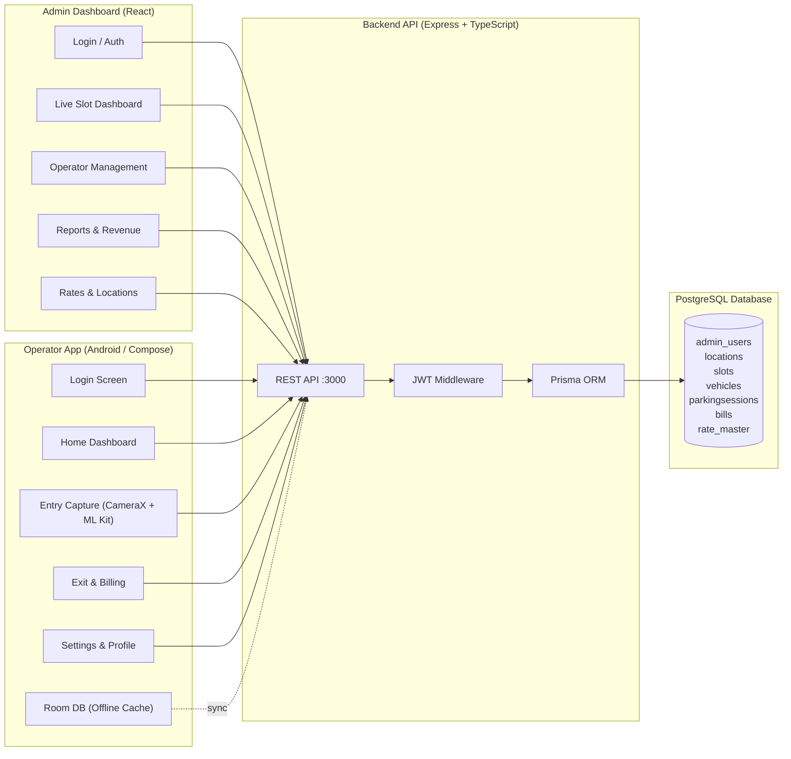
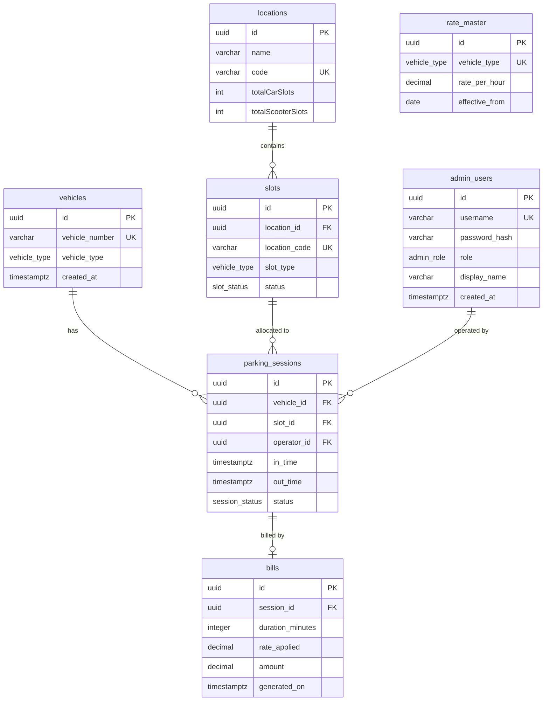

# Smart Parking Management System

[](https://nodejs.org/)
[](https://www.postgresql.org/)
[](https://www.prisma.io/)
[](https://www.typescriptlang.org/)
[](https://react.dev/)
[](https://kotlinlang.org/)
[](https://developer.android.com/)

A full-stack smart parking facility management platform consisting of three integrated components:

| Component | Description |
|---|---|
| **Backend API** | Express + TypeScript REST API with JWT authentication and PostgreSQL via Prisma |
| **Admin Dashboard** | React + Vite web application for facility administrators |
| **Operator App** | Native Android (Jetpack Compose) application for gate operators — offline-first |

---

## Table of Contents

- [System Architecture](#system-architecture)
- [Repository Structure](#repository-structure)
- [Backend API](#backend-api)
  - [Tech Stack](#backend-tech-stack)
  - [API Reference](#api-reference)
  - [Database Schema](#database-schema)
  - [Getting Started (Backend)](#getting-started-backend)
- [Admin Dashboard (Frontend)](#admin-dashboard-frontend)
  - [Features](#admin-dashboard-features)
  - [Getting Started (Frontend)](#getting-started-frontend)
- [Operator Android App](#operator-android-app)
  - [Tech Stack](#android-tech-stack)
  - [Core Screens](#core-screens)
  - [Offline-First Architecture](#offline-first-architecture)
  - [Getting Started (Android)](#getting-started-android)
- [Available Scripts](#available-scripts)
- [License](#license)

---

## System Architecture


```mermaid
flowchart LR
    subgraph "Admin Dashboard (React)"
        A["Login / Auth"]
        B["Live Slot Dashboard"]
        C["Operator Management"]
        D["Reports & Revenue"]
        E["Rates & Locations"]
    end

    subgraph "Backend API (Express + TypeScript)"
        F["REST API :3000"]
        G["JWT Middleware"]
        H["Prisma ORM"]
    end

    subgraph "PostgreSQL Database"
        I[("admin_users\nlocations\nslots\nvehicles\nparkingsessions\nbills\nrate_master")]
    end

    subgraph "Operator App (Android / Compose)"
        J["Login Screen"]
        K["Home Dashboard"]
        L["Entry Capture (CameraX + ML Kit)"]
        M["Exit & Billing"]
        N["Settings & Profile"]
        O["Room DB (Offline Cache)"]
    end

    A & B & C & D & E --> F
    J & K & L & M & N --> F
    F --> G --> H --> I
    O -. sync .-> F
```

---

## Repository Structure

```
.
├── src/                          # Backend API source (TypeScript)
│   ├── app.ts                    # Express app factory
│   ├── index.ts                  # Server entry point
│   ├── middleware/
│   │   ├── auth.ts               # JWT authentication middleware
│   │   └── errorHandler.ts       # Global error handler
│   └── routes/
│       ├── auth.ts               # Login, profile, change-password
│       ├── entries.ts            # Vehicle entry (gate-in)
│       ├── exits.ts              # Vehicle exit + billing
│       ├── locations.ts          # Location info + live slot availability
│       ├── me.ts                 # Current user profile + today's summary
│       ├── notifications.ts      # Admin announcements
│       ├── operators.ts          # Operator CRUD (admin only)
│       ├── rates.ts              # Parking rate management
│       ├── reports.ts            # Revenue and session reports
│       ├── sessions.ts           # Active/historical session queries
│       ├── sites.ts              # Site management
│       └── slots.ts              # Slot status management
├── prisma/
│   ├── schema.prisma             # Prisma data model
│   ├── seed.ts                   # Idempotent database seeder
│   └── migrations/               # Versioned migration history
├── frontend/                     # Admin Dashboard (React + Vite + Tailwind)
│   └── src/
│       ├── pages/                # Dashboard pages (login, home, reports, etc.)
│       ├── components/           # Shared UI components
│       ├── api/                  # API client layer
│       └── context/              # Auth + app context
├── operator-app/                 # Native Android Operator App (Kotlin + Compose)
│   └── app/src/main/java/.../
│       ├── ui/screens/           # Compose screens (home, entry, exit, settings)
│       ├── data/repository/      # ParkingRepository + AuthRepository
│       ├── data/remote/dto/      # Retrofit DTOs
│       ├── data/local/entity/    # Room entities
│       └── data/local/           # AppDatabase (Room)
├── test/
│   ├── smoke.ts                  # Database constraint verification tests
│   └── api.ts                   # API integration tests
├── docs/
│   └── API_CONTRACT_ADDENDUM.md  # API contract documentation
├── .env.example                  # Environment variable template
├── package.json
└── tsconfig.json
```

---

## Backend API

### Backend Tech Stack

| Layer | Technology |
|---|---|
| Runtime | Node.js v18+ |
| Framework | Express 4 |
| Language | TypeScript 5.7+ |
| ORM | Prisma 6 |
| Database | PostgreSQL 16+ |
| Auth | JSON Web Tokens (JWT) + bcryptjs |
| Validation | Zod |

### API Reference

All routes are prefixed with `/api/v1`. Protected routes require `Authorization: Bearer <token>`.

#### Authentication

| Method | Endpoint | Auth | Description |
|---|---|---|---|
| `POST` | `/auth/login` | — | Login and receive JWT |
| `GET` | `/auth/me` | ✅ | Get current user profile |
| `PUT` | `/auth/me` | ✅ | Update profile (name, email) |
| `PUT` | `/auth/change-password` | ✅ | Change password (accepts camelCase & snake_case) |

#### Locations & Availability

| Method | Endpoint | Auth | Description |
|---|---|---|---|
| `GET` | `/locations` | ✅ | List all locations |
| `GET` | `/locations/:id/availability` | ✅ | Live slot availability including `car_total`, `scooter_total`, `total_slots` |

#### Parking Operations

| Method | Endpoint | Auth | Description |
|---|---|---|---|
| `POST` | `/entries` | ✅ | Record vehicle entry (idempotency key supported) |
| `POST` | `/exits` | ✅ | Process vehicle exit, compute bill |
| `GET` | `/sessions` | ✅ | List sessions (filterable by status/location) |

#### Operator & Admin

| Method | Endpoint | Auth | Description |
|---|---|---|---|
| `GET` | `/operators` | ✅ Admin | List all operators |
| `POST` | `/operators` | ✅ Admin | Create operator (sets username + password) |
| `PUT` | `/operators/:id` | ✅ Admin | Update operator |
| `DELETE` | `/operators/:id` | ✅ Admin | Delete operator |
| `GET` | `/me/today-summary` | ✅ | Today's entries, exits, parked count, revenue |
| `GET` | `/notifications` | ✅ | Admin announcements |

#### Rates & Reports

| Method | Endpoint | Auth | Description |
|---|---|---|---|
| `GET` | `/rates` | ✅ | Get current parking rates |
| `PUT` | `/rates` | ✅ Admin | Update rates |
| `GET` | `/reports` | ✅ Admin | Revenue reports |

### Database Schema


```mermaid
erDiagram
    admin_users {
        uuid id PK
        varchar username UK
        varchar password_hash
        admin_role role
        varchar display_name
        timestamptz created_at
    }

    locations {
        uuid id PK
        varchar name
        varchar code UK
        int totalCarSlots
        int totalScooterSlots
    }

    vehicles {
        uuid id PK
        varchar vehicle_number UK
        vehicle_type vehicle_type
        timestamptz created_at
    }

    slots {
        uuid id PK
        uuid location_id FK
        varchar location_code UK
        vehicle_type slot_type
        slot_status status
    }

    rate_master {
        uuid id PK
        vehicle_type vehicle_type UK
        decimal rate_per_hour
        date effective_from
    }

    parking_sessions {
        uuid id PK
        uuid vehicle_id FK
        uuid slot_id FK
        uuid operator_id FK
        timestamptz in_time
        timestamptz out_time
        session_status status
    }

    bills {
        uuid id PK
        uuid session_id FK
        integer duration_minutes
        decimal rate_applied
        decimal amount
        timestamptz generated_on
    }

    vehicles ||--o{ parking_sessions : "has"
    slots ||--o{ parking_sessions : "allocated to"
    parking_sessions ||--o| bills : "billed by"
    locations ||--o{ slots : "contains"
    admin_users ||--o{ parking_sessions : "operated by"
```

#### Custom PostgreSQL Constraints

Enforced via migration `20260904000002_add_custom_constraints`:

1. **Timestamp sanity** — `out_time` must be `NULL` or strictly greater than `in_time`.
2. **One active session per vehicle** — Partial unique index prevents duplicate entry for an already-parked vehicle.
3. **No slot double-booking** — Partial unique index prevents two concurrent sessions sharing the same slot.

### Getting Started (Backend)

#### Prerequisites
- [Node.js](https://nodejs.org/) v18+
- [PostgreSQL](https://www.postgresql.org/) v14+

#### Environment Setup
```bash
cp .env.example .env
```
Edit `.env`:
```env
DATABASE_URL="postgresql://<USER>:<PASSWORD>@localhost:5432/<DB>?schema=public"
JWT_SECRET="your-secret-key"
```

#### Install & Migrate
```bash
npm install
npm run db:migrate
npm run db:generate
npm run db:seed
```

#### Run Development Server
```bash
npm run dev        # Starts on http://localhost:3000
```

#### Available Backend Scripts

| Command | Description |
|---|---|
| `npm run dev` | Start dev server with hot-reload |
| `npm run build` | Compile TypeScript to `dist/` |
| `npm start` | Run compiled production build |
| `npm run db:migrate` | Run pending Prisma migrations |
| `npm run db:generate` | Regenerate Prisma Client |
| `npm run db:seed` | Seed baseline data |
| `npm run db:reset` | Drop DB, re-migrate, re-seed |
| `npm run test:smoke` | Run DB constraint verification suite |
| `npm run test:api` | Run API integration tests |

---

## Admin Dashboard (Frontend)

A React + Vite + Tailwind CSS admin web application served from `frontend/`.

### Admin Dashboard Features

- **Live Slot Availability** — Real-time card view per location with car/scooter/total counts
- **Operator Management** — Create operators (set username & password), edit, deactivate
- **Parking Sessions** — Live view of active vehicles, historical session lookup
- **Revenue Reports** — Daily/weekly/monthly revenue breakdown
- **Rate Management** — Update hourly parking rates per vehicle type
- **Site/Location Management** — Add and configure parking locations

### Getting Started (Frontend)

```bash
cd frontend
npm install
npm run dev        # Starts on http://localhost:5173
```

The frontend proxies all `/api/v1` requests to the backend at `http://localhost:3000`.

For a production build:
```bash
npm run build      # Outputs to frontend/dist/
```

---

## Operator Android App

A native Android application for gate-level parking operators. Located in `operator-app/`.

> A pre-built debug APK is available at `frontend/public/operator-app.apk` and can be downloaded directly from the admin dashboard.

### Android Tech Stack

| Layer | Technology |
|---|---|
| Language | Kotlin 2.0+ (JVM 17) |
| UI | Jetpack Compose + Material 3 |
| Camera | CameraX |
| OCR | Google ML Kit Text Recognition (on-device) |
| Local DB | Room 2.6+ (v2) |
| Networking | Retrofit 2 + OkHttp 4 + Gson |
| Background Sync | AndroidX WorkManager |
| Secure Storage | EncryptedSharedPreferences (AES-256 GCM) |
| Min SDK | 26 (Android 8.0+) |

### Core Screens

| Screen | Description |
|---|---|
| **Login** | Username/password login; offline fallback using cached credentials |
| **Home Dashboard** | Assigned location name, live Car/Scooter/Total slot availability (dynamic from backend), today's entries/exits/revenue, gate entry/exit actions |
| **Capture Entry** | Full-screen CameraX viewfinder + ML Kit OCR plate extraction, vehicle type selector, confirm entry |
| **Capture Exit** | Plate lookup, session details, bill computation (ceiling-hour pricing), receipt screen |
| **Active Sessions** | Live Room `Flow`-backed list of parked vehicles; unsynced entries show "Pending Sync" badge |
| **Settings** | Profile editor (name, email), change password, app info |

### Offline-First Architecture

```
┌────────────────────────────────────────────┐
│             Jetpack Compose UI             │
└────────────────────────────────────────────┘
      ▲  Flow (reads)       │  User actions
      │                     ▼
┌──────────────┐    ┌──────────────────────┐
│  Room DB     │◄───│  ParkingRepository   │
│ (local truth)│    │  + AuthRepository    │
└──────────────┘    └──────────────────────┘
                              │ Writes outbox
                              ▼
┌────────────────────────────────────────────┐
│          SyncWorker (WorkManager)          │
│         + ConnectivityObserver             │
└────────────────────────────────────────────┘
                              │ POSTs when online
                              ▼
┌────────────────────────────────────────────┐
│       Backend API (:3000/api/v1/...)       │
└────────────────────────────────────────────┘
```

- **Outbox Pattern**: Entry/exit writes happen locally first; `SyncWorker` delivers them to the backend when connectivity is available.
- **Idempotency**: Every action carries a client-generated UUID. Duplicate deliveries (retry after network drop) are safely deduplicated by the backend.
- **Dynamic Slot Totals**: `carTotal`, `scooterTotal`, `totalSlots` are returned by the availability endpoint and cached in Room — no hardcoded values.

### Room Database Entities (v2)

| Entity | Key Fields |
|---|---|
| `location_assignment` | id, name, code, city, lastUpdated |
| `slot_availability` | locationId, carVacant, carOccupied, scooterVacant, scooterOccupied, **carTotal, scooterTotal, totalSlots**, lastUpdated |
| `rate_master` | vehicleType, ratePerHour, effectiveFrom |
| `active_sessions` | id, vehicleNumber, vehicleType, slotCode, inTime, isPendingSync |
| `pending_actions` | id, actionType, payloadJson, status, retryCount |
| `receipts` | id, sessionId, amount, durationMinutes, isPendingConfirmation |

### Getting Started (Android)

#### Build
```bash
cd operator-app
.\gradlew.bat assembleDebug
# APK: app/build/outputs/apk/debug/app-debug.apk
```

#### Install on Device via ADB
```bash
# Forward backend port to device
adb reverse tcp:3000 tcp:3000

# Install APK
adb install app/build/outputs/apk/debug/app-debug.apk
```

#### Run Unit Tests
```bash
.\gradlew.bat testDebugUnitTest --no-daemon
```

#### Operator Account Setup

Administrators create operator accounts via the Admin Dashboard (Operator Management page). The admin sets the initial username and password. Operators can later change their password and update their profile from the **Settings** screen in the app.

---

## License

ISC
